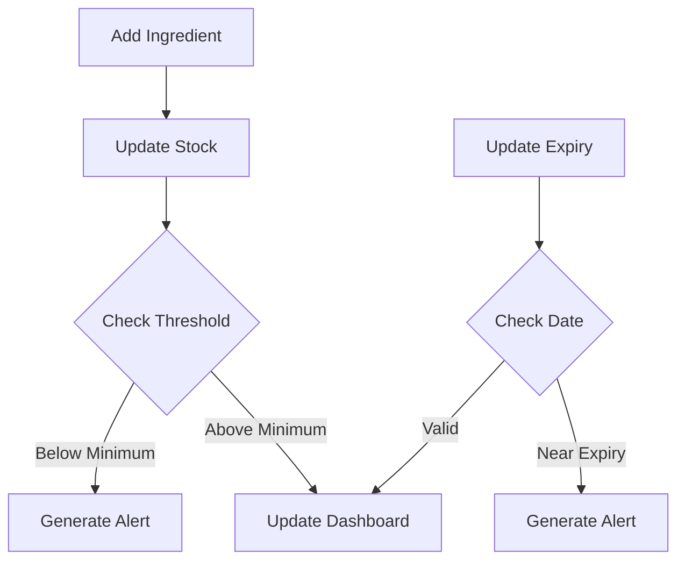
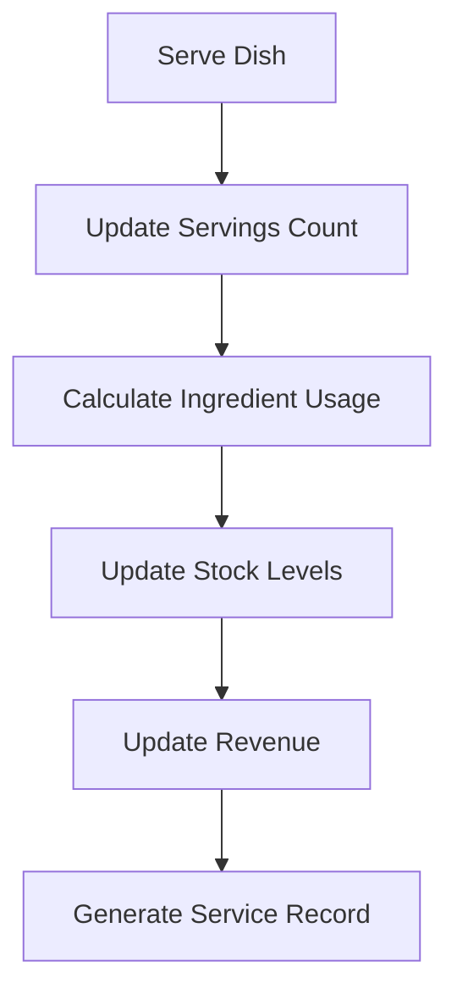

# Restaurant Management System

A comprehensive web application for managing restaurant inventory, dishes, and service tracking. This system helps restaurants efficiently manage their stock, track ingredient consumption, and monitor service performance in real-time.

## Features

### 1. Inventory Management
- **Stock Tracking**: Real-time monitoring of ingredient quantities
- **Categories**: Organize ingredients by categories (Vegetables, Meat, Dairy, etc.)
- **Low Stock Alerts**: Automatic notifications when ingredients fall below threshold
- **Expiry Tracking**: Monitor ingredient expiration dates to reduce waste
- **Supplier Management**: Track supplier information and lot numbers

### 2. Recipe & Dish Management
- **Recipe Builder**: Create and manage dishes with precise ingredient quantities
- **Cost Calculation**: Automatic calculation of:
  - Cost per serving
  - Profit margins
  - Recipe total cost
- **Portion Control**: Track ingredient usage per dish
- **Menu Categories**: Organize dishes by categories

### 3. Service Period Tracking
- **Service Windows**: Track different service periods (Breakfast, Lunch, Dinner)
- **Real-time Updates**: Monitor dishes served during each period
- **Performance Metrics**: Track:
  - Number of servings
  - Revenue generated
  - Popular dishes
  - Ingredient consumption

### 4. Analytics & Reporting
- **Daily Summary**: Overview of:
  - Total revenue
  - Top-selling dishes
  - Most used ingredients
- **Cost Analysis**: Track:
  - Food cost percentage
  - Profit margins
  - Revenue per dish
- **Inventory Usage**: Monitor:
  - Daily consumption
  - Waste tracking
  - Stock turnover

## Data Flow

1. **Inventory Input**
   - Add new ingredients with:
     - Name, quantity, unit
     - Category assignment
     - Minimum threshold
     - Cost information
     - Supplier details
     - Expiry date

2. **Recipe Creation**
   - Create dishes with:
     - Required ingredients
     - Quantities per serving
     - Selling price
     - Category assignment

3. **Service Tracking**
   - Record dishes served
   - Automatic updates:
     - Ingredient stock levels
     - Daily consumption metrics
     - Revenue calculations

4. **Analytics Processing**
   - Real-time calculations:
     - Stock levels
     - Cost analysis
     - Performance metrics
     - Alert generation

## Process Flow

### Inventory Management


### Dish Service Flow


## Technical Implementation

### State Management
- React Context API for global state management
- Local Storage for data persistence
- Real-time updates across components

### Database Schema
- **Ingredients Table**
  - `id`: UUID
  - `name`: String
  - `quantity`: Number
  - `unit`: String
  - `category`: String
  - `minThreshold`: Number
  - `lastUpdated`: Timestamp
  - `consumedToday`: Number
  - `expiryDate`: Date
  - `cost`: Number
  - `supplier`: String
  - `lotNumber`: String

- **Dishes Table**
  - `id`: UUID
  - `name`: String
  - `price`: Number
  - `category`: String
  - `servingsToday`: Number
  - `lastServed`: Timestamp
  - `costPerServing`: Number
  - `profitMargin`: Number

- **Service Records Table**
  - `id`: UUID
  - `date`: Timestamp
  - `periodId`: String
  - `dishId`: UUID
  - `quantity`: Number
  - `revenue`: Number
  - `cost`: Number
  - `profit`: Number

### Security
- Row Level Security (RLS) enabled
- Authentication required for all operations
- Role-based access control

## Getting Started

1. Clone the repository
2. Install dependencies:
   ```bash
   npm install
   ```
3. Set up environment variables:
   ```env
   VITE_SUPABASE_URL=your_supabase_url
   VITE_SUPABASE_ANON_KEY=your_supabase_key
   ```
4. Start the development server:
   ```bash
   npm run dev
   ```

## Technology Stack

- **Frontend**: React with TypeScript
- **Styling**: Tailwind CSS
- **Icons**: Lucide React
- **Database**: Supabase
- **Build Tool**: Vite
- **Date Handling**: date-fns
- **Notifications**: react-hot-toast

## Best Practices

1. **Stock Management**
   - Regular inventory audits
   - Set appropriate minimum thresholds
   - Monitor expiry dates

2. **Recipe Management**
   - Standardize portion sizes
   - Regular cost analysis
   - Update prices based on ingredient costs

3. **Service Tracking**
   - Monitor peak service times
   - Track popular dishes
   - Analyze consumption patterns

4. **Data Accuracy**
   - Regular system backups
   - Validate stock counts
   - Monitor unusual patterns